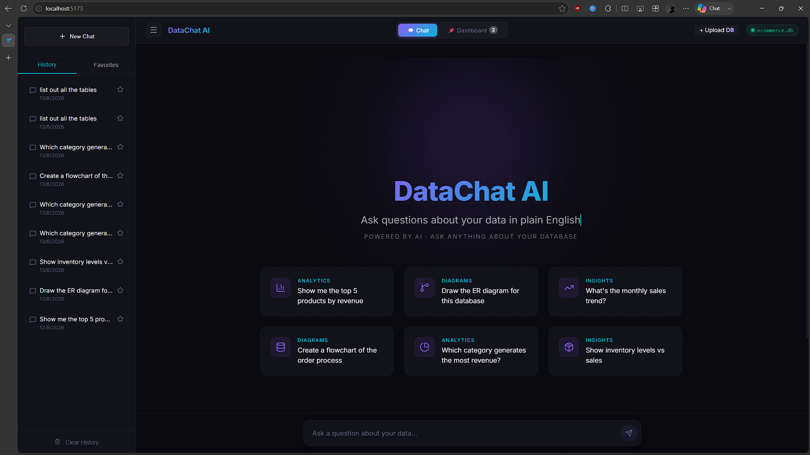
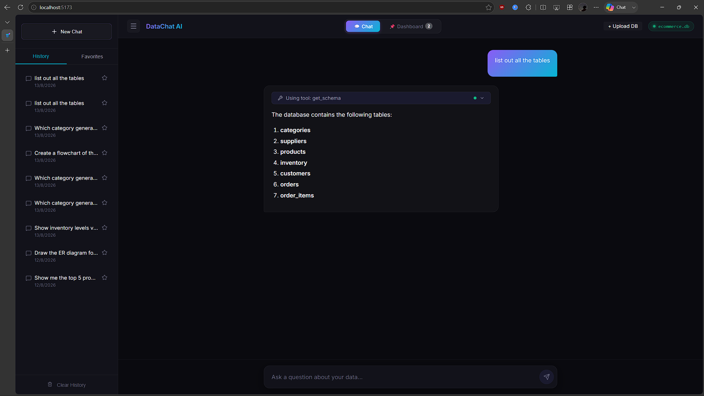
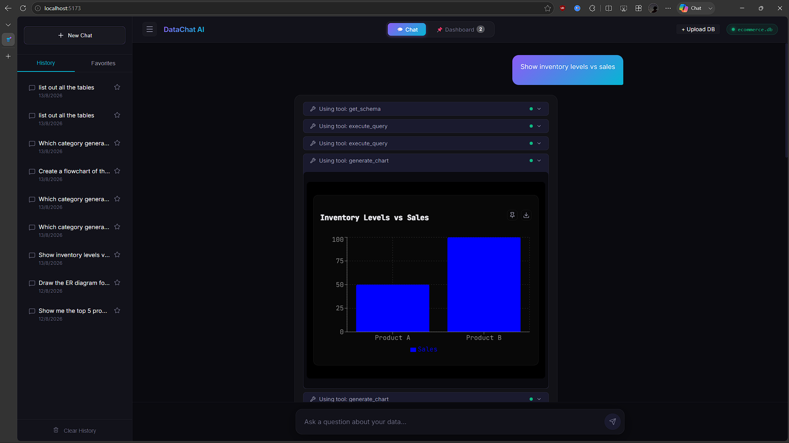
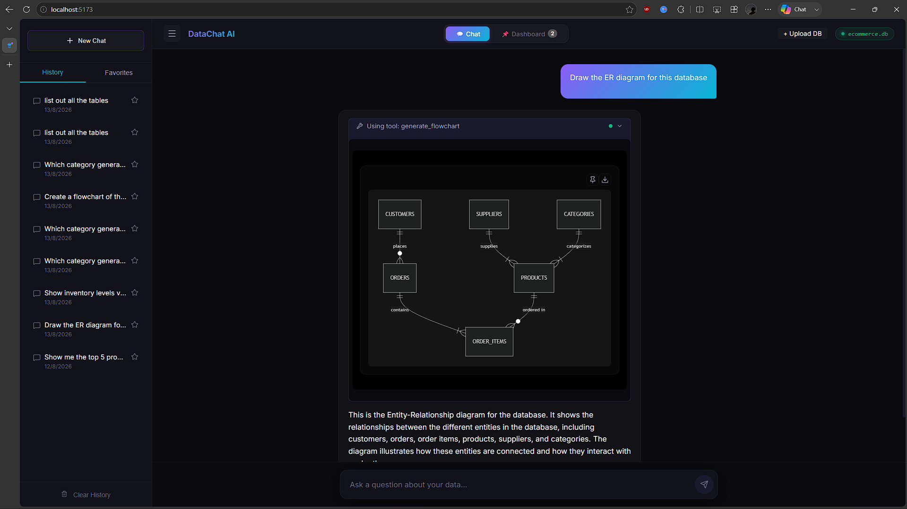
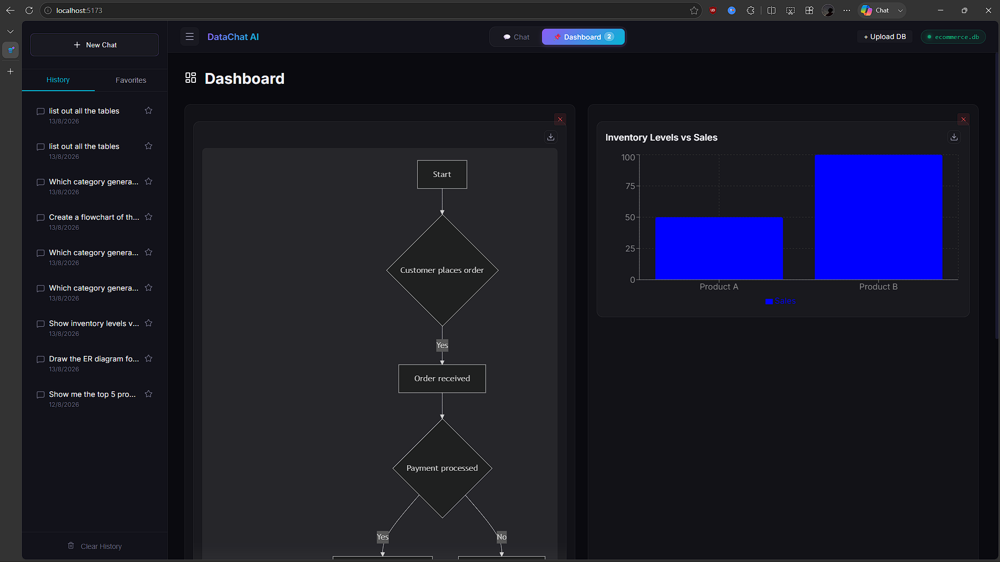

# 🧠 DataChat AI

**Conversational AI for Natural Language Database Intelligence**

Ask questions about your database in plain English. Get instant SQL queries, interactive charts, ER diagrams, and conversational insights — all through a ChatGPT-like streaming interface.


---

## ✨ What It Does

A non-technical user types a question like:

> *"Show me the top 5 products by revenue"*

The AI agent autonomously:
1. **Inspects** the database schema to understand tables and relationships
2. **Writes & executes** a safe SQL query
3. **Generates** an interactive bar chart from the results
4. **Explains** the key insights in plain English

All of this happens in real-time with streaming responses — you see the AI thinking, calling tools, and building the answer step by step.

---

## 📸 Screenshots

- **Home Page / Database Upload:** Connect to the default database or upload your own SQLite file.
  <br>
- **Chat Interface:** Ask questions in plain English and get instant data insights.
  <br>
- **Auto-Generated Charts:** Visualizations are rendered inline automatically.
  <br>
- **Database Architecture:** Visualize schemas dynamically with Mermaid ER diagrams.
  <br>
- **Interactive Dashboard:** Pin your favorite charts and flowcharts to a persistent dashboard.
  <br>

---

## 🎯 Key Features

| Feature | Description |
|---------|-------------|
| 💬 **Natural Language Queries** | Ask data questions in plain English — no SQL knowledge needed |
| 📊 **Auto-Generated Charts** | Bar, line, pie, and scatter charts rendered inline from query results |
| 📐 **Diagram Generation** | ER diagrams, process flowcharts, and decision trees via Mermaid.js |
| 🔍 **SQL Transparency** | See the generated SQL before execution — learn as you query |
| 🤖 **Multi-LLM Support** | OpenAI → Anthropic → Groq automatic fallback chain |
| ⚡ **Real-Time Streaming** | SSE-powered streaming — see the AI think and respond in real-time |
| 📌 **Dashboard Builder** | Pin any chart or diagram to a persistent dashboard |
| 📜 **Query History** | Full history with timestamps, favorites, and re-run capability |
| 📤 **Database Upload** | Upload your own SQLite databases via drag-and-drop |
| 📥 **CSV Export** | Export query results as downloadable CSV files |
| 📸 **Image Export** | Download any chart, diagram, or table as a high-quality PNG image |

---

## 🏗️ Architecture

```
┌──────────────────────────────────────────────────────────────┐
│                   React + Vite + TypeScript                   │
│  ┌───────────┐  ┌───────────┐  ┌───────────┐  ┌──────────┐ │
│  │ Chat UI   │  │ Recharts  │  │ Mermaid.js│  │Dashboard │ │
│  │ Streaming │  │ Charts    │  │ Diagrams  │  │ Builder  │ │
│  └─────┬─────┘  └───────────┘  └───────────┘  └──────────┘ │
│        │  SSE (Server-Sent Events)                           │
├────────┼─────────────────────────────────────────────────────┤
│        ▼           FastAPI Backend                            │
│  ┌──────────┐   ┌─────────────────────────────────────────┐ │
│  │ POST     │   │         LLM Agent Loop (8 iterations)   │ │
│  │ /api/chat│──▶│  OpenAI  → Anthropic → Groq (fallback) │ │
│  └──────────┘   │                                         │ │
│                 │  Tools:                                  │ │
│                 │  ├── get_schema    (discover tables)     │ │
│                 │  ├── execute_query (safe SQL execution)  │ │
│                 │  ├── generate_chart (bar/line/pie/scatter)│ │
│                 │  ├── generate_flowchart (ER/flow/tree)   │ │
│                 │  └── explain_data  (insights & analysis) │ │
│                 └─────────────────────────────────────────┘ │
│                          │                                   │
│                 ┌────────▼────────┐                          │
│                 │ SQLite Database  │                          │
│                 │ (any .db file)   │                          │
│                 └─────────────────┘                          │
└──────────────────────────────────────────────────────────────┘
```

---

## 🚀 Quick Start

### Prerequisites

| Requirement | Minimum Version | Download |
|-------------|----------------|----------|
| Python | 3.11+ | [python.org](https://python.org/downloads) |
| Node.js | 18+ | [nodejs.org](https://nodejs.org) |
| API Key | At least **one** of the below | See links |

**Supported LLM Providers** (you need at least one):
- [OpenAI](https://platform.openai.com/api-keys) — Best tool-calling quality (`gpt-4o-mini`)
- [Anthropic](https://console.anthropic.com/) — Claude models (`claude-3.5-sonnet`)
- [Groq](https://console.groq.com/) — **Free tier available** (`llama-3.3-70b`) ← start here if unsure

### Step 1 — Clone & Configure

```bash
git clone https://github.com/YOUR_USERNAME/datachat-ai.git
cd datachat-ai

# Create your environment file
cp .env.example .env
```

Open `.env` in any text editor and paste your API key:
```env
# Just fill in ONE of these — the app auto-detects which to use:
OPENAI_API_KEY=sk-your-key-here
# ANTHROPIC_API_KEY=sk-ant-your-key-here
# GROQ_API_KEY=gsk_your-key-here
```

### Step 2 — Start the Backend

```bash
cd backend

# (Optional but recommended) Create a virtual environment
python -m venv .venv
# Windows:
.venv\Scripts\activate
# macOS/Linux:
# source .venv/bin/activate

# Install Python dependencies
pip install -r requirements.txt

# Start the server
python main.py
```

You should see:
```
INFO:     Uvicorn running on http://0.0.0.0:8000
INFO:     DataChat AI backend started successfully
```

> The sample e-commerce database (50 customers, 20 products, 200 orders) is automatically created on first run.

### Step 3 — Start the Frontend

Open a **new terminal**:
```bash
cd frontend

# Install Node dependencies
npm install

# Start the dev server
npm run dev
```

You should see:
```
VITE v8.x.x  ready in XXX ms
➜  Local:   http://localhost:5173/
```

### Step 4 — Open & Use

Go to **http://localhost:5173** in your browser and start asking questions!

**Try these example queries:**
- *"Show me the top 5 products by revenue"*
- *"Draw the ER diagram for this database"*
- *"What's the monthly sales trend?"*
- *"Which category generates the most revenue? Show it as a pie chart"*
- *"Create a flowchart of the order process"*

---

## 🗄️ Using Your Own Database

You can use **any SQLite database** — the AI agent automatically discovers all tables, columns, and relationships.

**Option 1 — Replace the default:**
```bash
# Replace the default e-commerce database
cp your_database.db backend/ecommerce.db
# Restart backend
```

**Option 2 — Add alongside:**
```bash
# Drop any .db file in the backend/ folder
cp your_database.db backend/
# It will appear in the /api/databases list automatically
```

**Option 3 — Upload via API:**
```bash
curl -F "file=@your_database.db" http://localhost:8000/api/upload-database
```

---

## 🛠️ Tech Stack & Justifications

| Layer | Technology | Why This Choice |
|-------|-----------|-----------------|
| **Frontend** | React 19 + TypeScript + Vite | Component model handles complex UI (streaming chat + inline charts + dashboard). Vite gives sub-second hot reload. TypeScript catches bugs at compile time. |
| **Styling** | Vanilla CSS + Custom Properties | Zero dependencies. Full control over glassmorphism, animations, and responsive design. CSS variables enable runtime theming. |
| **Charts** | Recharts | React-native SVG charts (~45KB gzipped vs Plotly's ~1.2MB). Declarative API maps naturally to LLM-generated JSON specs. |
| **Diagrams** | Mermaid.js | Industry-standard text-to-diagram. LLMs generate Mermaid syntax with high accuracy. Supports ER, flowchart, and decision trees. |
| **Backend** | Python / FastAPI | Native async/await + SSE streaming. Python has the best LLM SDK ecosystem. FastAPI auto-generates OpenAPI docs at `/docs`. |
| **LLM Integration** | OpenAI + Anthropic + Groq SDKs | Multi-provider fallback ensures reliability. All three support function/tool calling for the agent loop. |
| **Database** | SQLite | Zero-config embedded database. Ships with seeded sample data. Easy to swap with any `.db` file. |
| **Streaming** | Server-Sent Events (SSE) | Simpler than WebSockets for unidirectional LLM token streaming. Works through all proxies. Native browser support. |
| **Markdown** | react-markdown + remark-gfm | Renders LLM responses with tables, code blocks, and custom code-block interception for embedding charts/diagrams inline. |

---

## 🔧 How the Agent Works

The agent uses an **iterative tool-calling loop** (max 8 iterations):

```
User Question
    ↓
┌─────────────────────────┐
│  LLM receives question  │
│  + tool definitions     │◄──────────────┐
│  + conversation history │               │
└────────┬────────────────┘               │
         │                                │
    LLM decides:                          │
    text response? → stream to user       │
    tool call?     ↓                      │
         │                                │
┌────────▼────────────────┐               │
│  Execute tool:          │               │
│  get_schema / sql /     │               │
│  chart / flowchart /    │               │
│  explain_data           │               │
└────────┬────────────────┘               │
         │                                │
    Feed result back ─────────────────────┘
    (repeat until done)
```

### The 5 Tools

| Tool | What It Does | Safety |
|------|-------------|--------|
| `get_schema` | Discovers all tables, columns, data types, and foreign keys | Read-only |
| `execute_query` | Runs SQL queries against the database | **SELECT-only** — INSERT/UPDATE/DELETE/DROP blocked. 500 row limit. |
| `generate_chart` | Creates chart JSON specs (bar, line, pie, scatter) | Output only |
| `generate_flowchart` | Creates Mermaid diagram code (ER, flowchart, decision tree) | Output only |
| `explain_data` | Triggers the LLM to analyze and explain query results | Prompt only |

---

## 📁 Project Structure

```
datachat-ai/
├── backend/
│   ├── main.py              # FastAPI server — SSE streaming, upload, export endpoints
│   ├── agent.py             # LLM agent loop — tool calling, system prompt, iteration
│   ├── llm_client.py        # Multi-provider LLM client (OpenAI/Anthropic/Groq)
│   ├── database.py          # SQLite connection manager & query executor
│   ├── seed.sql             # Sample e-commerce data (50 customers, 200 orders)
│   ├── requirements.txt     # Python dependencies
│   └── tools/
│       ├── get_schema.py    # Database schema introspection
│       ├── execute_query.py # Safe SQL execution (SELECT-only, sqlparse validation)
│       ├── generate_chart.py    # Recharts-compatible JSON chart specs
│       ├── generate_flowchart.py # Mermaid diagram code blocks
│       └── explain_data.py  # Data insight prompt wrapper
│
├── frontend/
│   ├── index.html           # Entry point with Google Fonts + SEO meta tags
│   ├── vite.config.ts       # Vite config with API proxy
│   ├── package.json
│   └── src/
│       ├── App.tsx          # Main app — chat/dashboard views, sidebar toggle
│       ├── index.css        # Design system — colors, animations, scrollbar
│       ├── types/index.ts   # TypeScript interfaces
│       ├── hooks/
│       │   ├── useChat.ts       # SSE streaming hook — parses agent events
│       │   └── useQueryHistory.ts # localStorage-backed query history
│       └── components/
│           ├── WelcomeScreen    # Animated landing with suggestion cards
│           ├── ChatInterface    # Message list + input container
│           ├── ChatMessage      # User/assistant bubbles + tool call steps
│           ├── ChatInput        # Auto-resizing textarea + send button
│           ├── MarkdownRenderer # Markdown with chart/diagram code block interception
│           ├── DynamicChart     # Recharts wrapper (bar/line/pie/scatter)
│           ├── MermaidDiagram   # Mermaid.js renderer with dark theme
│           ├── SqlPreview       # Collapsible SQL query viewer
│           ├── Sidebar          # History list with favorites + tabs
│           ├── Dashboard        # Pinned charts/diagrams grid
│           └── ThinkingIndicator # Animated "Agent is thinking" bubble
│
├── .env.example             # Template for API keys
├── .gitignore
└── README.md
```

---

## 🔌 API Reference

| Method | Endpoint | Description |
|--------|----------|-------------|
| `POST` | `/api/chat` | Stream a chat response (SSE). Body: `{ message, history, database }` |
| `GET` | `/api/schema?db=name` | Get database schema as JSON |
| `GET` | `/api/databases` | List available `.db` files |
| `POST` | `/api/upload-database` | Upload a SQLite database file (multipart form) |
| `POST` | `/api/export-csv` | Export SQL results as CSV. Body: `{ query, database }` |
| `GET` | `/api/health` | Health check |
| `GET` | `/docs` | Interactive Swagger UI (auto-generated) |

---

## ⚙️ Environment Variables

| Variable | Required | Default | Description |
|----------|----------|---------|-------------|
| `OPENAI_API_KEY` | One of three* | — | OpenAI API key (primary) |
| `ANTHROPIC_API_KEY` | One of three* | — | Anthropic API key (secondary) |
| `GROQ_API_KEY` | One of three* | — | Groq API key (free fallback) |
| `DATABASE_PATH` | No | `./ecommerce.db` | Default SQLite database path |

\* At least **one** API key must be set. The app auto-detects and uses the first available in priority order: OpenAI → Anthropic → Groq.

---

## 📄 License

MIT License
```
You’re free to use, tweak, and build on this project.  
Have fun with it, break things, improve things 🙂  
